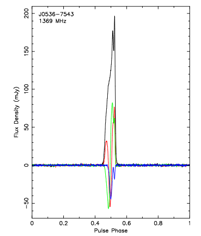
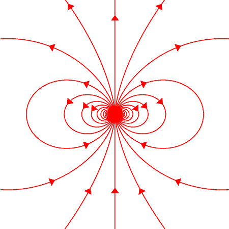
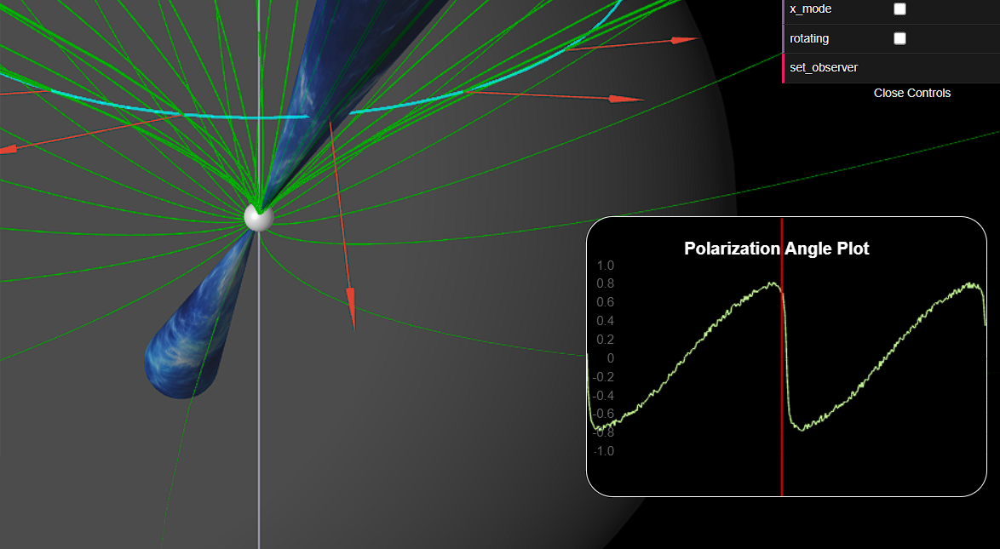
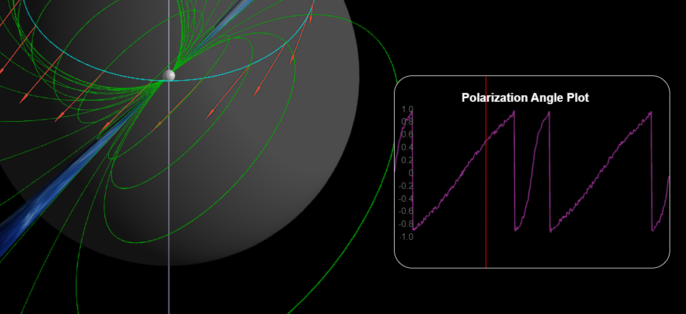
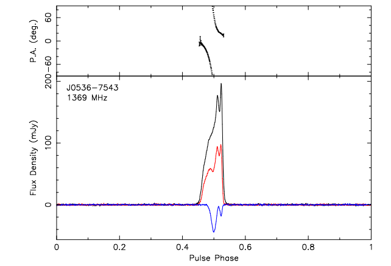

# Rotating Vector Model Visualization
## Pulsars
At the end of their lives (as their nuclear fuel runs out), stars can take different paths depending on their mass:
* Smallest stars, brown or red dwarfs, die off very slowly, becoming more and more dim
* Average stars, like our sun, often grow to being a red giant, then collapse into a nebula with a white dwarf in its center
* Massive stars are where it really gets interesting. These grow into supergiants then explode in supernovas, leaving either a neutron star (the case where mass wins-- the star is held together with degeneracy pressure) or a black hole (the case where gravity wins).

Pulsars, or rotating neutron stars, are some of the most extreme objects in the universe. They are incredibly dense and have extremely hot spots, and they rotate unbelivably fast. They are also extremely strong magnets, making for an interesting object of study.

*Vela Pusar Jet, Chandra X-ray Observatory*

Pulsars have long beams coming out of their magnetic poles, mostly composed of radio emissions. As a result of their fast spinning, we can observe these beams every time they are momentarily oriented towards us, creating a lighthouse effect. The graph below illustrates one of these radiation peaks seen once every rotation.

*Johnston, S. and Kerr, M. (2018). Polarimetry of 600 pulsars from observations at 1.4 GHz with the Parkes radio telescope.*
## Rotating Vector Model

We can approxiamte the magnetic field of a neutron star to that of a dipole. 

It is important to note that this model works best on slow spinning pulsars (rather than millisecond pulsars, for example). Although it works well near the surface, this model also becomes less accurate further from the pulsar, as the magentic field lines would need a velocity near that of the speed of light to co-rotate with the pulsar. The reason for this is that the tangential velocity is equal to the product of the angular velocity and the radius from the pulsar's center, so as distance (radius) from the pulsar increases, so does the tangential velocity. However, since this speed cannot exceed that of light, the field lines drag behind, creating a spiral shape.

The polarization vectors point in the direction of the electric field of the EM wave (so perpendicular to their propagation). These are depicted in the simulation as arrows on the plane of magnetic field. They are changed due to the magnetic field, which acts as follows: particles that emit radiation have to follow the magnetic field, limiting the direction of polarization either in the plane (o-mode) or perpendicular (x-mode) to the plane of the magnetic field.

Radhakrishnan and Cooke (1969) first brought to light this periodic change in polarization angle (PA), which we can plot using the Rotating Vector Model (RVM) explained above.

## Creation of the visualization
This visualizations is created using JavaScript, specifically making use of Three.js, which is a library that allows for the visualization of 3D objects in a browser. It also makes use of WebGLPlot to make real-time dynamic plots.

### Field Lines
As we can see, the magnetic field lines emanate radially out of both magnetic poles, modeled after a magnetic dipole.

### Magnetic and Rotation Axes
Two axes slice through the pulsar, one being its rotational axis (which is always assumed to be perfectly vertical), the other being its magnetic axis. This latter axis intersects both magnetic poles, as we can observe, are the origins of the magnetic field lines.

It is possible to change the orientation of the magnetic axis by changing the dipole angle. The beam along this axis will follow its orientation, modeled by a cone with plasma-like texture.

All these elements can then rotate with a custom rotation speed. High rotation speeds will simulate actual pulsar behavior and demonstrate the previously described lighthouse effect.

## Polarization Angle Plot
Created using WebGLPlot, the PA plot follows the observer with a red vertical line as they rotate the pulsar. It also follows the automatic rotation of the star. The plot has a bit of a static effect to illustrate it as being dynamic. A "lock observer" option has been added to better allow the correlation between vector orientation and the resulting plot to be understood.

$$\psi=\arctan\left(\frac{\sin\theta\sin\phi}{\cos\chi\sin\theta\cos\phi-\sin\chi\cos\theta}\right)$$

Where: 
* $\theta$ is the dipole angle (relative to the axis of rotation)
* $\chi$ is the observer angle, determining the circle swept by the line of sight
* $\phi$ is the phase angle, tracking where we are in a revolution
* $\psi$ is the resulting polarization angle

### Interpretations
The PA graph reaches its max/mins when the PA is $\frac{\pi}{2}$ or $-\frac{\pi}{2}$, corresponding to when the vectors appear tangent to the circle swept by the line of sight. This happens at different times depending on which mode was chosen: `o-mode` will show vectors as parallel to the magnetic field plane, whereas `x-mode` will show them as perpendicular. The opposite is true for when the plot is at 0. 

The plot will have the greastest slope when the change in PA is greatest

*Above shows the transition period between two extremas on the plot with a dramatic change in between. We can understand this geometrically: the vector pointing straight down during the maximum change actually appears to have a polarization angle of 0 because it is perpendicular to the circle swept by the line of sight, whereas the ones around it are almost orthogonal.*

#### *Limits of the arctan function*

The use of the arctan function to model the change in PA entrains some mathematic subtleties. 

The most important of these is caused by the fact that arctan will always return an angle between $-\pi/2$ and $\pi/2$, meaning that once these angles are outside these bounds, they will jump back down or up to being inside these values, basically like taking a modulus. 

This has the effect of making vectors that are orthogonal to the circle swept by line of sight but in opposite directions actually appear to both have a PA of 0. This also causes a discontinuity different than the dramatic shift (which really represents a quick PA change). We observe this discontinuity when the dipole angle becomes larger than the observer angle, as the PA function's denominator changes sign.

*The example above shows the 90 degree jumps in polarization due both to the orientation of vectors as well as the arctangent.*

### Comparison to reality

In reality, there really is a change in PA that follows the RVM. However, we can only really observe this change when the neutron star's beam is facing us. During that short moment, we observe a discontinuity similar to one from our PA plot.

*Johnston, S. and Kerr, M. (2018). Polarimetry of 600 pulsars from
observations at 1.4 GHz with the Parkes radio telescope.*

*The lower part of the figure shows the
integrated profile in total intensity (black), linear polarization (red) and circular polarization
(blue). 
As we can see here, it is always true that the greatest change in polarization happens at a spike of radiation, when the star's beam faces Earth.*